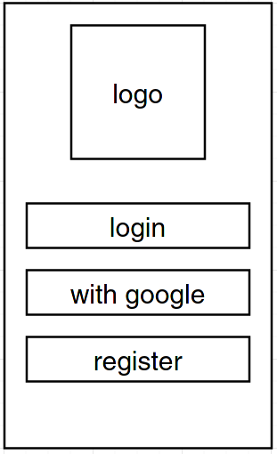
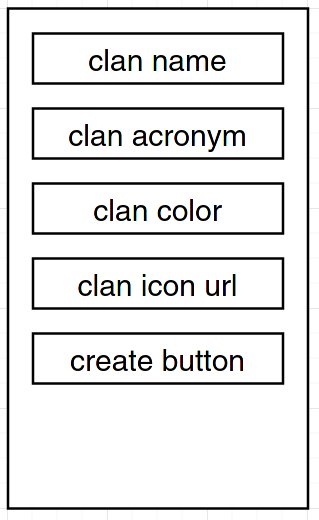
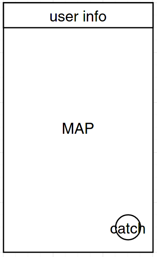
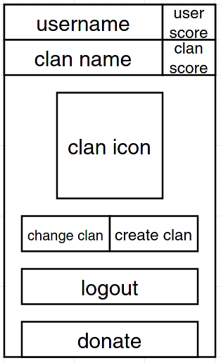

# Street Fight

Street Fight es un MMORPG no lineal en el que escribes tu propia historia sin limitarte a seguir un camino prefijado, explora un amplio mundo abierto. Todo cuanto hagas tendrá su repercusión en la realidad.

## Descripcíon general

El programa es un juego, en el cual tu principal objetivo es la conquista de banderas, ganando puntos para tu clan (de momento los puntos no sirven para nada), lo cual a su vez genera un factor competitivo.

### Resumen de funcionabilidades

Android y Web

- Visualizar las banderas en el mapa.
- Iniciar sesion en la cuenta de usuario.
- Posibilidad de crear, unirse y gestionar un clan.

Android APP

- Localizacion del usuario en un mapa.
- Captura de banderas.
- Crear una cuenta de usuario.

Web

- Ver el top 10 de clanes.
- Ver el top 10 de jugadores.
- Buscar clanes y/o jugadores.

Bot de Twitter

- Mostrar un top clanes cuando cambie el top.
- Mostrar un top usuarios cuando cambie el top.
- Responder a ciertos comandos.
- Follow por follow automatico.
- RT y FAV con palabras que se ajusten a nuestro criterio.


> El equipo de Street Fight no se hace responsable de los posibles conflictos ocasionados por la competitividad de los usuarios.

## Mockups UI

### Android APP

El juego en sí.

#### Pantalla principal sin sesión iniciada



#### Pantalla de login


#### Pantalla de registro


#### Pantalla de unirse a un clan


- Una opción de simplificación es eliminar el selector de clanes que hay al crearse una cuenta nueva, simplemente se podría substituir por un textbox donde introducir el nombre exacto del clan en la pantalla de registro.

#### Pantalla de creación de clan



#### Pantalla principal con sesión iniciada



#### Pantalla detalle de usuario



#### Pantalla proceso de captura

- Los números 4/6 indican cuantos usuarios están intentando capturar la bandera, 4 de tu grupo y 6 de otros.


#### Pantalla proceso de captura OK


### Webpage

Destinada a consultar estadísticas, ver el mapa global y editar tu perfil y tu clan.

#### Pantalla principal sin sesión iniciada


#### Pantalla de login


#### Pantalla de inicio con sesión iniciada


#### Pantalla de detalle de usuario


#### Pantalla modo edición del usuario

- Si el usuario es el fundador de su clan, también puede editar sus atributos.


#### Pantalla de búsqueda de clan o usuario

- Para buscar no es necesario iniciar sesión.
- En caso de haber iniciado sesión, al lado de cada clan (resultado de búsqueda) aparecerá un botón (Join) que te permitirá unirte al clan.


### Bot de Twitter

Se encarga anunciar publicamene cambios grandes en el desarrollo del juego y permite consultar estadísticas resumidas.

#### Difusión automatizada

Mensaje de difusión cuando un clan captura una bandera (si esa bandera esta en blanco).

```
El clan Los Pepes ha capturado la bandera de Afundación.
```

Mensaje de difusión cuando un clan captura una bandera y otro clan la pierde.

```
El clan Los Pepes ha robado la bandera de Afundación al clan Los Juanjos.
```

Mensaje de difusión para la puntuación del los top clanes (10).

```
El nuevo top 10 de clanes es:
- clan 1 (score)
- clan 2 (score)
- clan 3 (score)
- etc
```

Mensaje de difusión para la puntuación del los top usuarios (10).

```
El nuevo top 10 de usuarios es:
- user 1 (score)
- user 2 (score)
- user 3 (score)
- etc
```

#### Respuestas a solicitudes (comandos)

Top de clanes (número variable).

- Solicitudes

```
Top clanes 30
```

- Respuestas

```
El top 30 de clanes es:
- clan 1 (score)
- clan 2 (score)
- clan 3 (score)
- etc
```

Top de usuarios (número variable).

- Solicitudes

```
Top usuarios 15
```

- Respuestas

```
El top 15 de usuarios es:
- user 1 (score)
- user 2 (score)
- user 3 (score)
- etc
```

Consulta clan (nombre exacto)

- Solicitudes

```
Info del clan Los Pepes
```

```
Información del clan Los Pepes
```

- Respuestas

```
El clan Los Pepes (LP) tiene una puntuación de 675, ha capturado 40 banderas y tiene 30 miembros.
```

- Errores

```
No existe ningún clan con el nombre 'Los Pepes'.
```

Consulta usuario  (nombre exacto)

- Solicitudes

```
Info del usuario Pikachu78
```

```
Información del usuario Pikachu78
```

- Respuestas

```
El usuario Pikachu78 tiene una puntuación de 50, ha capturado 10 banderas y pertenece al clan Pokimons En Acción (PEA).
```

- Errores

```
No existe ningún usuario con el nombre 'Pikachu78'.
```

Comando no reconocido.

```
Oh, algo ha salido mal. Escribe 'ayuda' para saber como usar esto.
```

Comando ayuda.

- Solicitudes

```
Ayuda
```

```
Help
```

```
Ayúdame
```

- Respuestas

```
- Ayuda
- Top clanes <número>
- Top usuarios <número>
- Info del clan <nombre_exacto>
- Info del usuario <nombre_exacto>
```

#### Funcionabilidades extra

- Follow por follow automatico.
- RT y FAV con palabras que se ajusten a nuestro criterio.

## Diagrama ER


## Tipos de datos

### Tabla CLAN
- id INT PRIMARY KEY
- nombre VARCHAR(25) NOT NULL
- abreviatura CHAR(4)
- color CHAR(7) NOT NULL
- url_icono VARCHAR(300)
- fecha_fundacion DATETIME NOT NULL
- id_fundador INT FOREIGN KEY

### Tabla USUARIO
- id INT PRIMARY KEY
- nombre VARCHAR(25) NOT NULL
- banderas_capturadas INT NOT NULL
- salt VARCHAR(40) NOT NULL
- clave_sha_concatenada VARCHAR(40) NOT NULL
- id_clan INT NOT NULL FOREIGN KEY

### Tabla SESION
- id INT PRIMARY KEY
- id_usuario INT NOT NULL FOREIGN KEY
- fecha_caducidad DATETIME NOT NULL
- valor_cookie VARCHAR(40) NOT NULL

### Tabla BANDERA
- id INT PRIMARY KEY
- nombre VARCHAR(50) NOT NULL
- descripcion VARCHAR(500) NOT NULL
- latitud DOUBLE NOT NULL
- longitud DOUBLE NOT NULL
- id_clan INT NOT NULL FOREIGN KEY

### Tabla INTENTO_CAPTURA
- id_usuario INT NOT NULL FOREIGN KEY
- id_bandera INT NOT NULL FOREIGN KEY
- fecha DATETIME NOT NULL
- PRIMARY KEY (id_usuario, id_bandera, timestamp)

> Todos los datos de fecha (DATE) se guaradrán en Europe/Madrid. Se puede modificar la sentencia `TIME_ZONE = 'Europe/Madrid'` en el archivo `settings.py` de tu proyecto Django para definir el uso horário.

## API REST

### Definición OpenAPI

[Archivo de definición del OpenAPI](openapi.yaml)
